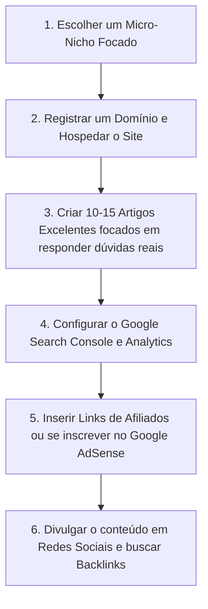

# Guia de Monetização de Sites e SEO: Como Escolher um Nicho e Chegar ao Topo do Google

Para criar um site e ganhar dinheiro com ele, você precisa entender o cruzamento de duas forças: **o que as pessoas estão buscando** (Volume de Busca) e **o quão dispostas elas estão a gastar** (Intenção de Compra). 

Este guia explica quais são os nichos mais lucrativos, as formas de transformar acessos em dinheiro e o passo a passo para colocar o seu site na primeira página do Google.

---

## 1. O que as pessoas mais buscam e o que dá mais dinheiro? (Nichos Lucrativos)

Embora termos gerais (como "futebol", "fofocas" ou "notícias") tenham milhões de buscas, eles são altamente competitivos e difíceis de monetizar com alto retorno. O segredo para ganhar dinheiro na internet está nos **Micro-nichos de Alto Valor**.

Abaixo estão os nichos mais promissores e lucrativos para criar um site:

| Nicho | Sub-nichos / Exemplos Práticos | Por que é lucrativo? |
| :--- | :--- | :--- |
| **Inteligência Artificial & Ferramentas SaaS** | Diretórios de IAs para imobiliárias, tutoriais de automação de tarefas, reviews de geradores de imagem. | Empresas de IA pagam comissões recorrentes muito altas para afiliados que indicam novos clientes. |
| **Finanças Pessoais & Investimentos** | Como sair das dívidas, comparativos de cartões de crédito para milhas, guia de investimentos para iniciantes. | O CPC (Custo por Clique) de anúncios desse setor é o mais alto do mercado. Bancos e corretoras pagam muito por leads. |
| **Saúde Digital, Longevidade & Bem-estar** | Dieta cetogênica para iniciantes, rotinas de sono saudável, saúde mental para trabalhadores remotos. | Grande apelo emocional. Fácil de vender e-books, cursos e infoprodutos focados em resolver dores de saúde. |
| **Carreiras, Produtividade & E-learning** | Cursos rápidos de programação nocode, templates de Notion para organização, guias de transição de carreira. | As pessoas buscam qualificação rápida para ganhar mais dinheiro. Alta conversão de venda direta de templates/cursos. |
| **H hobbies de Alto Ticket** | Fotografia profissional, ciclismo de estrada, equipamentos para home office premium, jardinagem hidropônica. | Usuários apaixonados por hobbies costumam gastar muito em produtos físicos. Ótimo para marketing de afiliados (ex: Amazon). |

> [!TIP]
> **Foque no Micro-Nicho:** Em vez de fazer um site sobre "Tecnologia", faça sobre "Ferramentas de IA para Contadores". A concorrência é muito menor e quem pesquisa isso já tem uma intenção muito clara de compra ou contratação.

---

## 2. Como Ganhar Dinheiro com o Seu Link (Modelos de Monetização)

Existem várias formas de transformar as visitas do seu site em dinheiro real. As principais são:

1. **Marketing de Afiliados (Recomendado para Começar):**
   * **Como funciona:** Você se cadastra em plataformas (Amazon, Hotmart, Monetizze, Kiwify, ShareASale) e coloca links para produtos de terceiros. Sempre que alguém clica no seu link e compra, você ganha uma comissão (que varia de 3% a 80% do valor do produto).
   * **Exemplo:** Um post comparando "Os 5 melhores microfones para podcast" com links da Amazon de cada um.

2. **Anúncios Display (Google AdSense ou Redes Premium como Ezoic/Mediavine):**
   * **Como funciona:** Você cede espaços no seu site para o Google exibir anúncios. Você ganha dinheiro toda vez que alguém visualiza (CPM) ou clica (CPC) nesses banners.
   * **Exemplo:** Banners de propaganda no topo ou nas laterais dos seus artigos.

3. **Venda de Produtos Digitais Próprios (Infoprodutos):**
   * **Como funciona:** Você mesmo cria um material de valor e vende diretamente no site.
   * **Exemplo:** E-books em PDF, planilhas financeiras otimizadas, templates do Notion ou minicursos em vídeo.

4. **Conteúdo Patrocinado (Publipost):**
   * **Como funciona:** Quando seu site ganha autoridade, marcas pagam para você escrever um artigo recomendando o serviço/produto delas.

---

## 3. Como colocar o seu Link no Topo do Google (SEO)

Aparecer no topo do Google organicamente (sem pagar por anúncios) é chamado de **SEO (Search Engine Optimization)**. O Google usa robôs para ler e classificar todos os sites da internet. Para agradar a esses robôs e aos usuários, você precisa seguir estes passos:

### Passo A: Escolha da Palavra-Chave Certa (Keyword Research)
Você não deve escrever sobre o que acha bonito, mas sim sobre **o que as pessoas estão ativamente pesquisando**.
* Use ferramentas gratuitas como o **Google Keyword Planner**, **Ubersuggest** ou **AnswerThePublic** para ver o volume de busca de termos.
* **Palavras-chave de cauda longa (Long-tail):** Em vez de tentar ranquear para "Emagrecer" (quase impossível para sites novos), tente "Como emagrecer de forma saudável em casa sem equipamentos".

### Passo B: Otimização On-Page (Dentro do Site)
Quando você criar uma página ou artigo, organize-a para que o Google entenda o conteúdo facilmente:
* **Título da Página (Heading 1 / H1):** Deve conter a palavra-chave principal logo no início.
* **Subtítulos (H2, H3):** Divida o texto de forma organizada usando a palavra-chave e variações dela.
* **URL Amigável:** Crie links curtos e descritivos. (Exemplo correto: `seusite.com/como-investir-pouco-dinheiro` em vez de `seusite.com/p=1293874`).
* **Meta Description:** Escreva um resumo chamativo de até 150 caracteres que aparecerá na pesquisa do Google para atrair cliques.

### Passo C: SEO Técnico (Velocidade e Celular)
O Google penaliza sites lentos ou ruins de navegar.
* **Responsividade:** O site **precisa** funcionar perfeitamente no celular (Mobile-First).
* **Velocidade:** Use imagens compactadas (formato WebP) para que o site carregue em menos de 2 segundos.
* **Segurança:** Use certificado SSL (o link deve começar com `https://`).

### Passo D: SEO Off-Page & Autoridade (Backlinks)
O Google mede a relevância do seu site através do voto de confiança de outros sites.
* Se um site grande e respeitável aponta um link para o seu artigo, o Google entende que o seu site também é confiável.
* **Como conseguir:** Escreva conteúdos tão bons que outros sites naturalmente usem você como fonte, ou faça parcerias (Guest Posts) escrevendo artigos para outros blogs do seu setor em troca de um link.

---

## 4. O Caminho Alternativo e Mais Rápido: Google Ads

Se você não quer esperar meses para que o SEO orgânico traga visitas, você pode pagar ao Google para colocar seu link no topo imediatamente na seção **"Patrocinado"**.

* **Como funciona:** Você cria uma conta no **Google Ads**, escolhe as palavras-chave que deseja e define quanto quer pagar por cada clique que receber (CPC).
* **Atenção:** Esse método exige investimento financeiro inicial e muito cuidado. Se você pagar R$ 1,00 por clique, mas seu site não converter os visitantes em vendas, você perderá dinheiro.

---

## 5. Plano de Ação Passo a Passo para Começar Hoje

1. **Escolha o tema:** Pegue algo que você goste ou tenha facilidade de aprender, e que tenha apelo comercial (Finanças, IA, Beleza, Pets, etc.).
2. **Crie a estrutura:** Registre um domínio (`seu-site.com.br`) no Registro.br e contrate uma hospedagem simples (como Hostinger ou Hostgator) rodando WordPress.
3. **Produza conteúdo de valor:** Responda as maiores dúvidas que as pessoas têm no Google sobre o seu nicho. Escreva de forma clara, direta e completa.
4. **Monetize:** Cadastre-se na Amazon Associados ou na Hotmart e comece a indicar os produtos dentro dos seus textos de forma natural.
5. **Cadastre no Google:** Use o **Google Search Console** (ferramenta gratuita) para enviar o mapa do seu site (Sitemap) diretamente ao Google. Isso avisa aos robôs que o seu site existe e deve ser listado.
